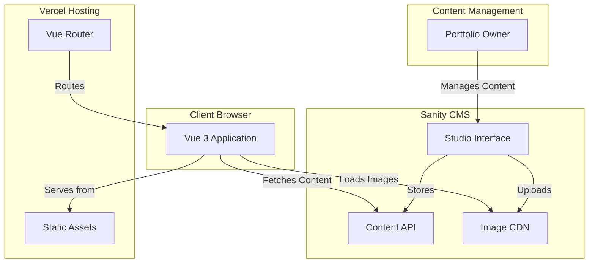
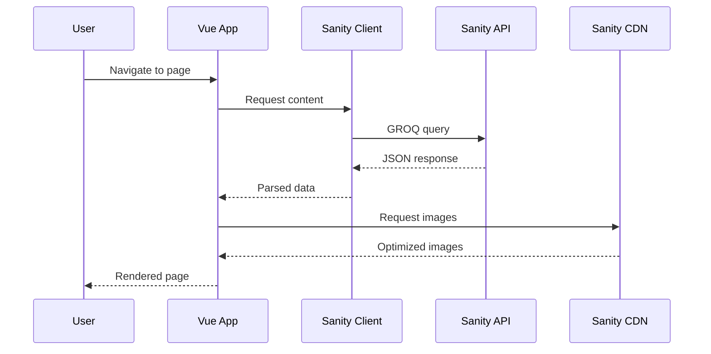

# Design Document: Portfolio Rebuild with Sanity CMS

## Overview

This design document outlines the architecture and implementation strategy for rebuilding a portfolio website with Sanity CMS integration. The system consists of a Vue 3 frontend application that fetches and displays content from Sanity CMS, enabling content management without code changes.

### System Goals

- Decouple content management from code deployment
- Maintain visual consistency with the existing portfolio design
- Enable dynamic project management through Sanity CMS
- Provide responsive experience across all devices
- Optimize for performance and SEO on Vercel hosting

### Key Design Decisions

1. **Headless CMS Architecture**: Sanity CMS serves as the single source of truth for all content, with the Vue application acting as a presentation layer
2. **Static Generation with Dynamic Data**: Leverage Vite's build process while fetching fresh content from Sanity at runtime
3. **Component-Based Architecture**: Maintain Vue 3 composition API patterns for consistency with existing codebase
4. **Image Optimization**: Use Sanity's image CDN with URL parameters for responsive image delivery
5. **Environment-Based Configuration**: Separate development and production Sanity datasets

## Architecture

### High-Level System Architecture



### Data Flow Architecture



### Technology Stack

- **Frontend Framework**: Vue 3.4+ with Composition API
- **Build Tool**: Vite 5.0+
- **Styling**: Tailwind CSS 3.4+
- **Routing**: Vue Router 4.2+
- **CMS**: Sanity.io (latest stable)
- **Sanity Client**: @sanity/client
- **Image Handling**: @sanity/image-url
- **Hosting**: Vercel
- **Animations**: GSAP 3.12+ (existing)

## Components and Interfaces

### Vue Application Structure

```
src/
├── main.js                 # Application entry point
├── App.vue                 # Root component
├── index.css              # Global styles
├── sanity/
│   ├── client.js          # Sanity client configuration
│   ├── queries.js         # GROQ queries
│   └── imageBuilder.js    # Image URL builder
├── composables/
│   ├── useSanityData.js   # Composable for fetching Sanity data
│   └── useImageUrl.js     # Composable for image URL generation
├── router/
│   └── index.js           # Vue Router configuration
├── views/
│   ├── HomeView.vue       # Home page
│   ├── AboutView.vue      # About page
│   ├── ProjectsView.vue   # Projects listing
│   ├── ContactView.vue    # Contact page
│   ├── NavbarView.vue     # Navigation component
│   └── PrivacyPolicyView.vue
├── components/
│   ├── projects/
│   │   ├── ProjectCard.vue           # Project preview card
│   │   ├── ProjectGrid.vue           # Projects grid layout
│   │   └── project-details/
│   │       └── ProjectDetailsView.vue # Project detail page
│   ├── common/
│   │   ├── LoadingSpinner.vue        # Loading state
│   │   ├── ErrorMessage.vue          # Error display
│   │   └── ImageGallery.vue          # Image carousel
│   └── sanity/
│       └── PortableText.vue          # Rich text renderer
```

### Sanity Studio Structure

```
sanity-studio/
├── sanity.config.js       # Studio configuration
├── sanity.cli.js          # CLI configuration
├── package.json
├── schemas/
│   ├── index.js           # Schema registry
│   ├── project.js         # Project document schema
│   ├── homePage.js        # Home page content schema
│   ├── aboutPage.js       # About page content schema
│   ├── contactPage.js     # Contact page content schema
│   └── objects/
│       ├── platformLink.js    # Platform availability object
│       ├── techStackItem.js   # Tech stack item object
│       └── imageWithAlt.js    # Image with alt text object
```

### Key Interfaces

#### Sanity Client Configuration

```javascript
// src/sanity/client.js
import { createClient } from '@sanity/client'

export const sanityClient = createClient({
  projectId: import.meta.env.VITE_SANITY_PROJECT_ID,
  dataset: import.meta.env.VITE_SANITY_DATASET,
  useCdn: true, // Use CDN for production
  apiVersion: '2024-01-01',
})
```

#### Image URL Builder

```javascript
// src/sanity/imageBuilder.js
import imageUrlBuilder from '@sanity/image-url'
import { sanityClient } from './client'

const builder = imageUrlBuilder(sanityClient)

export function urlFor(source) {
  return builder.image(source)
}
```

#### Data Fetching Composable

```javascript
// src/composables/useSanityData.js
import { ref, onMounted } from 'vue'
import { sanityClient } from '@/sanity/client'

export function useSanityData(query, params = {}) {
  const data = ref(null)
  const loading = ref(true)
  const error = ref(null)

  const fetchData = async () => {
    try {
      loading.value = true
      data.value = await sanityClient.fetch(query, params)
    } catch (err) {
      error.value = err.message
    } finally {
      loading.value = false
    }
  }

  onMounted(fetchData)

  return { data, loading, error, refetch: fetchData }
}
```

## Data Models

### Sanity Schema Definitions

#### Project Schema

```javascript
// sanity-studio/schemas/project.js
export default {
  name: 'project',
  title: 'Project',
  type: 'document',
  fields: [
    {
      name: 'title',
      title: 'Title',
      type: 'string',
      validation: Rule => Rule.required()
    },
    {
      name: 'slug',
      title: 'Slug',
      type: 'slug',
      options: {
        source: 'title',
        maxLength: 96
      },
      validation: Rule => Rule.required()
    },
    {
      name: 'category',
      title: 'Category',
      type: 'string',
      options: {
        list: [
          { title: 'Mobile App', value: 'mobile' },
          { title: 'Web App', value: 'web' },
          { title: 'Game', value: 'game' },
          { title: 'Other', value: 'other' }
        ]
      },
      validation: Rule => Rule.required()
    },
    {
      name: 'date',
      title: 'Project Date',
      type: 'date',
      validation: Rule => Rule.required()
    },
    {
      name: 'featured',
      title: 'Featured Project',
      type: 'boolean',
      description: 'Display this project prominently',
      initialValue: false
    },
    {
      name: 'platformAvailability',
      title: 'Platform Availability',
      type: 'array',
      of: [{ type: 'platformLink' }]
    },
    {
      name: 'techStack',
      title: 'Tech Stack',
      type: 'array',
      of: [{ type: 'techStackItem' }]
    },
    {
      name: 'credits',
      title: 'Credits',
      type: 'text',
      rows: 3
    },
    {
      name: 'images',
      title: 'Project Images',
      type: 'array',
      of: [{ type: 'imageWithAlt' }],
      validation: Rule => Rule.required().min(1)
    },
    {
      name: 'shortDescription',
      title: 'Short Description',
      type: 'text',
      rows: 3,
      description: 'Brief description for project cards',
      validation: Rule => Rule.required().max(200)
    },
    {
      name: 'fullDescription',
      title: 'Full Description',
      type: 'array',
      of: [
        { type: 'block' },
        {
          type: 'image',
          fields: [
            {
              name: 'alt',
              type: 'string',
              title: 'Alternative text'
            }
          ]
        }
      ],
      validation: Rule => Rule.required()
    },
    {
      name: 'order',
      title: 'Display Order',
      type: 'number',
      description: 'Lower numbers appear first',
      initialValue: 0
    }
  ],
  orderings: [
    {
      title: 'Display Order',
      name: 'orderAsc',
      by: [{ field: 'order', direction: 'asc' }]
    },
    {
      title: 'Date, Newest',
      name: 'dateDesc',
      by: [{ field: 'date', direction: 'desc' }]
    }
  ],
  preview: {
    select: {
      title: 'title',
      category: 'category',
      media: 'images.0.image'
    },
    prepare({ title, category, media }) {
      return {
        title,
        subtitle: category,
        media
      }
    }
  }
}
```

#### Platform Link Object

```javascript
// sanity-studio/schemas/objects/platformLink.js
export default {
  name: 'platformLink',
  title: 'Platform Link',
  type: 'object',
  fields: [
    {
      name: 'platform',
      title: 'Platform',
      type: 'string',
      options: {
        list: [
          { title: 'iOS App Store', value: 'ios' },
          { title: 'Android Play Store', value: 'android' },
          { title: 'Web', value: 'web' },
          { title: 'GitHub', value: 'github' }
        ]
      },
      validation: Rule => Rule.required()
    },
    {
      name: 'url',
      title: 'URL',
      type: 'url',
      validation: Rule => Rule.required()
    }
  ],
  preview: {
    select: {
      platform: 'platform',
      url: 'url'
    },
    prepare({ platform, url }) {
      return {
        title: platform,
        subtitle: url
      }
    }
  }
}
```

#### Tech Stack Item Object

```javascript
// sanity-studio/schemas/objects/techStackItem.js
export default {
  name: 'techStackItem',
  title: 'Tech Stack Item',
  type: 'object',
  fields: [
    {
      name: 'name',
      title: 'Technology Name',
      type: 'string',
      validation: Rule => Rule.required()
    },
    {
      name: 'icon',
      title: 'Icon',
      type: 'image',
      description: 'Optional icon for the technology'
    }
  ],
  preview: {
    select: {
      title: 'name',
      media: 'icon'
    }
  }
}
```

#### Image with Alt Object

```javascript
// sanity-studio/schemas/objects/imageWithAlt.js
export default {
  name: 'imageWithAlt',
  title: 'Image',
  type: 'object',
  fields: [
    {
      name: 'image',
      title: 'Image',
      type: 'image',
      options: {
        hotspot: true
      },
      validation: Rule => Rule.required()
    },
    {
      name: 'alt',
      title: 'Alternative Text',
      type: 'string',
      description: 'Important for SEO and accessibility',
      validation: Rule => Rule.required()
    },
    {
      name: 'caption',
      title: 'Caption',
      type: 'string'
    }
  ],
  preview: {
    select: {
      media: 'image',
      title: 'alt'
    }
  }
}
```

#### Page Content Schemas

```javascript
// sanity-studio/schemas/homePage.js
export default {
  name: 'homePage',
  title: 'Home Page',
  type: 'document',
  fields: [
    {
      name: 'title',
      title: 'Page Title',
      type: 'string',
      validation: Rule => Rule.required()
    },
    {
      name: 'heroHeading',
      title: 'Hero Heading',
      type: 'string',
      validation: Rule => Rule.required()
    },
    {
      name: 'heroSubheading',
      title: 'Hero Subheading',
      type: 'text',
      rows: 2
    },
    {
      name: 'heroImage',
      title: 'Hero Image',
      type: 'imageWithAlt'
    },
    {
      name: 'featuredProjects',
      title: 'Featured Projects',
      type: 'array',
      of: [{ type: 'reference', to: [{ type: 'project' }] }],
      validation: Rule => Rule.max(6)
    },
    {
      name: 'content',
      title: 'Page Content',
      type: 'array',
      of: [{ type: 'block' }]
    }
  ],
  preview: {
    prepare() {
      return {
        title: 'Home Page'
      }
    }
  }
}
```

```javascript
// sanity-studio/schemas/aboutPage.js
export default {
  name: 'aboutPage',
  title: 'About Page',
  type: 'document',
  fields: [
    {
      name: 'title',
      title: 'Page Title',
      type: 'string',
      validation: Rule => Rule.required()
    },
    {
      name: 'profileImage',
      title: 'Profile Image',
      type: 'imageWithAlt'
    },
    {
      name: 'bio',
      title: 'Biography',
      type: 'array',
      of: [{ type: 'block' }],
      validation: Rule => Rule.required()
    },
    {
      name: 'skills',
      title: 'Skills',
      type: 'array',
      of: [{ type: 'string' }]
    },
    {
      name: 'experience',
      title: 'Experience',
      type: 'array',
      of: [{ type: 'block' }]
    }
  ],
  preview: {
    prepare() {
      return {
        title: 'About Page'
      }
    }
  }
}
```

```javascript
// sanity-studio/schemas/contactPage.js
export default {
  name: 'contactPage',
  title: 'Contact Page',
  type: 'document',
  fields: [
    {
      name: 'title',
      title: 'Page Title',
      type: 'string',
      validation: Rule => Rule.required()
    },
    {
      name: 'heading',
      title: 'Heading',
      type: 'string',
      validation: Rule => Rule.required()
    },
    {
      name: 'description',
      title: 'Description',
      type: 'text',
      rows: 3
    },
    {
      name: 'email',
      title: 'Email Address',
      type: 'string',
      validation: Rule => Rule.required().email()
    },
    {
      name: 'socialLinks',
      title: 'Social Links',
      type: 'array',
      of: [
        {
          type: 'object',
          fields: [
            {
              name: 'platform',
              title: 'Platform',
              type: 'string',
              options: {
                list: [
                  'GitHub',
                  'LinkedIn',
                  'Twitter',
                  'Instagram',
                  'Other'
                ]
              }
            },
            {
              name: 'url',
              title: 'URL',
              type: 'url'
            }
          ]
        }
      ]
    }
  ],
  preview: {
    prepare() {
      return {
        title: 'Contact Page'
      }
    }
  }
}
```

### GROQ Queries

```javascript
// src/sanity/queries.js

// Fetch all projects for listing page
export const projectsQuery = `
  *[_type == "project"] | order(order asc, date desc) {
    _id,
    title,
    slug,
    category,
    date,
    featured,
    shortDescription,
    "mainImage": images[0].image,
    "mainImageAlt": images[0].alt
  }
`

// Fetch single project by slug
export const projectBySlugQuery = `
  *[_type == "project" && slug.current == $slug][0] {
    _id,
    title,
    slug,
    category,
    date,
    platformAvailability,
    techStack,
    credits,
    images,
    fullDescription,
    shortDescription
  }
`

// Fetch home page content
export const homePageQuery = `
  *[_type == "homePage"][0] {
    title,
    heroHeading,
    heroSubheading,
    heroImage,
    content,
    "featuredProjects": featuredProjects[]-> {
      _id,
      title,
      slug,
      category,
      shortDescription,
      "mainImage": images[0].image,
      "mainImageAlt": images[0].alt
    }
  }
`

// Fetch about page content
export const aboutPageQuery = `
  *[_type == "aboutPage"][0] {
    title,
    profileImage,
    bio,
    skills,
    experience
  }
`

// Fetch contact page content
export const contactPageQuery = `
  *[_type == "contactPage"][0] {
    title,
    heading,
    description,
    email,
    socialLinks
  }
`
```

### Vue Component Data Structures

#### Project Card Component Props

```typescript
interface ProjectCardProps {
  project: {
    _id: string
    title: string
    slug: { current: string }
    category: string
    date: string
    shortDescription: string
    mainImage: SanityImageSource
    mainImageAlt: string
  }
}
```

#### Project Details Component Data

```typescript
interface ProjectDetails {
  _id: string
  title: string
  slug: { current: string }
  category: string
  date: string
  platformAvailability: Array<{
    platform: 'ios' | 'android' | 'web' | 'github'
    url: string
  }>
  techStack: Array<{
    name: string
    icon?: SanityImageSource
  }>
  credits: string
  images: Array<{
    image: SanityImageSource
    alt: string
    caption?: string
  }>
  fullDescription: PortableTextBlock[]
  shortDescription: string
}
```


## Correctness Properties

*A property is a characteristic or behavior that should hold true across all valid executions of a system—essentially, a formal statement about what the system should do. Properties serve as the bridge between human-readable specifications and machine-verifiable correctness guarantees.*

### Property 1: Navigation Completeness

*For any* pair of main pages (Home, About, Projects, Contact), navigating from one page to another should successfully route to the target page and render its content.

**Validates: Requirements 1.5**

### Property 2: Dynamic Project Routing

*For any* project with a valid slug, clicking on that project should route to a project detail page with the URL pattern `/projects/:slug` and render the project's content.

**Validates: Requirements 2.1**

### Property 3: Project Field Completeness

*For any* project retrieved from Sanity CMS, the rendered project detail page should display all required fields: title, category, date, platform availability, tech stack, credits, images, and descriptions.

**Validates: Requirements 2.2**

### Property 4: Data Synchronization

*For any* change to CMS content (adding a new project, updating existing project data, or deleting a project), after refetching data, the application should reflect the current state of the CMS (new projects appear, updated projects show new data, deleted projects are removed).

**Validates: Requirements 3.3, 4.1, 4.3**

### Property 5: Content Fetching on Mount

*For any* page component that displays CMS content, when the component mounts, it should initiate a fetch request to Sanity CMS and populate the component with the fetched data.

**Validates: Requirements 3.4, 7.2**

### Property 6: Content Parsing Correctness

*For any* valid Sanity CMS API response, the application should correctly parse the response data into the expected component data structures without data loss or type errors.

**Validates: Requirements 7.4**

### Property 7: Image URL Generation

*For any* Sanity image reference in project data, the application should generate a valid, accessible image URL using the Sanity image URL builder.

**Validates: Requirements 10.3**

### Property 8: Image Optimization Parameters

*For any* generated image URL, the URL should include optimization parameters (format, quality, or dimensions) to ensure efficient image delivery.

**Validates: Requirements 10.4**

## Error Handling

### Error Scenarios and Handling Strategies

#### 1. Sanity CMS Unreachable

**Scenario**: Network failure or Sanity API downtime prevents data fetching.

**Handling**:
- Catch fetch errors in the `useSanityData` composable
- Display user-friendly error message: "Unable to load content. Please check your connection and try again."
- Provide a "Retry" button to attempt refetch
- Log error details to console for debugging

**Implementation**:
```javascript
// In useSanityData composable
try {
  data.value = await sanityClient.fetch(query, params)
} catch (err) {
  error.value = {
    message: 'Unable to load content. Please check your connection and try again.',
    details: err.message
  }
  console.error('Sanity fetch error:', err)
}
```

#### 2. Invalid or Missing Environment Variables

**Scenario**: Required Sanity configuration (project ID, dataset) is missing or invalid.

**Handling**:
- Validate environment variables on application initialization
- Display clear error message indicating which variables are missing
- Prevent application from attempting API calls with invalid configuration
- Provide setup instructions in development mode

**Implementation**:
```javascript
// In sanity/client.js
const projectId = import.meta.env.VITE_SANITY_PROJECT_ID
const dataset = import.meta.env.VITE_SANITY_DATASET

if (!projectId || !dataset) {
  throw new Error(
    'Missing Sanity configuration. Please set VITE_SANITY_PROJECT_ID and VITE_SANITY_DATASET environment variables.'
  )
}
```

#### 3. Project Not Found

**Scenario**: User navigates to a project detail page with an invalid or deleted project slug.

**Handling**:
- Check if project data is null after fetch
- Display 404-style message: "Project not found"
- Provide link back to projects listing page
- Consider redirecting to projects page after a delay

**Implementation**:
```javascript
// In ProjectDetailsView.vue
const { data: project, loading, error } = useSanityData(
  projectBySlugQuery,
  { slug: route.params.projectId }
)

// In template
<div v-if="!loading && !project">
  <h2>Project Not Found</h2>
  <p>The project you're looking for doesn't exist.</p>
  <router-link to="/projects">View All Projects</router-link>
</div>
```

#### 4. Image Loading Failure

**Scenario**: Image URL is invalid or image fails to load from Sanity CDN.

**Handling**:
- Use `@error` event handler on `` tags
- Display placeholder image or fallback UI
- Log image URL for debugging
- Ensure alt text is always present for accessibility

**Implementation**:
```vue


<script setup>
const handleImageError = (event) => {
  console.error('Image failed to load:', event.target.src)
  event.target.src = '/images/placeholder.png'
}
</script>
```

#### 5. Malformed Content Data

**Scenario**: CMS returns data in unexpected format or with missing required fields.

**Handling**:
- Validate data structure after fetch
- Provide default values for optional fields
- Log warnings for missing required fields
- Display partial content with indication of missing data

**Implementation**:
```javascript
// Data validation helper
function validateProjectData(project) {
  const required = ['title', 'slug', 'category', 'date']
  const missing = required.filter(field => !project[field])
  
  if (missing.length > 0) {
    console.warn('Project missing required fields:', missing, project)
  }
  
  return {
    ...project,
    images: project.images || [],
    techStack: project.techStack || [],
    platformAvailability: project.platformAvailability || []
  }
}
```

#### 6. Portable Text Rendering Errors

**Scenario**: Rich text content contains unsupported block types or malformed structure.

**Handling**:
- Implement error boundary in PortableText component
- Render supported blocks, skip unsupported ones
- Log unsupported block types for schema updates
- Display fallback text if entire content fails to render

**Implementation**:
```vue
<!-- PortableText.vue -->
<template>
  <div v-if="renderError" class="content-error">
    <p>Unable to display content properly.</p>
  </div>
  <div v-else>
    <!-- Portable text rendering -->
  </div>
</template>

<script setup>
const renderError = ref(false)

const handleBlockError = (block) => {
  console.warn('Unsupported block type:', block._type)
  // Continue rendering other blocks
}
</script>
```

### Error Logging Strategy

- **Development**: Log all errors to console with full details
- **Production**: Log errors to console, consider integrating error tracking service (e.g., Sentry)
- **User-Facing**: Always show user-friendly messages, never expose technical details

## Testing Strategy

### Dual Testing Approach

This feature requires both unit tests and property-based tests to ensure comprehensive coverage. Unit tests verify specific examples and edge cases, while property-based tests verify universal properties across all inputs.

### Unit Testing

Unit tests focus on:
- **Specific examples**: Verify concrete scenarios work correctly
- **Edge cases**: Test boundary conditions and special cases
- **Error conditions**: Ensure proper error handling
- **Integration points**: Test component interactions

**Testing Framework**: Vitest (compatible with Vite)

**Key Unit Tests**:

1. **Route Configuration**
   - Test that all main routes (/, /about, /projects, /contact) are defined
   - Test that dynamic project route pattern exists
   - Test 404 handling for invalid routes

2. **Sanity Client Configuration**
   - Test client initialization with valid environment variables
   - Test error thrown when environment variables are missing
   - Test CDN mode is enabled in production

3. **Image URL Builder**
   - Test image URL generation with valid image reference
   - Test URL includes project ID and dataset
   - Test handling of null/undefined image references

4. **Responsive Breakpoints**
   - Test layout adapts at mobile breakpoint (< 768px)
   - Test layout adapts at tablet breakpoint (768px - 1024px)
   - Test layout adapts at desktop breakpoint (> 1024px)

5. **Typography**
   - Test that Mulish font is loaded and applied
   - Test that Playfair Display font is loaded and applied

6. **Error Display**
   - Test error message displays when Sanity is unreachable
   - Test "Project Not Found" message for invalid slug
   - Test retry functionality after fetch error

**Example Unit Test**:
```javascript
// sanity/client.test.js
import { describe, it, expect, beforeEach, afterEach } from 'vitest'
import { sanityClient } from './client'

describe('Sanity Client Configuration', () => {
  const originalEnv = import.meta.env

  afterEach(() => {
    import.meta.env = originalEnv
  })

  it('should initialize client with valid environment variables', () => {
    expect(sanityClient.config().projectId).toBeDefined()
    expect(sanityClient.config().dataset).toBeDefined()
  })

  it('should enable CDN mode', () => {
    expect(sanityClient.config().useCdn).toBe(true)
  })

  it('should throw error when project ID is missing', () => {
    import.meta.env.VITE_SANITY_PROJECT_ID = ''
    expect(() => {
      // Re-import to trigger initialization
    }).toThrow('Missing Sanity configuration')
  })
})
```

### Property-Based Testing

Property-based tests verify universal properties that should hold for all valid inputs. Each test runs a minimum of 100 iterations with randomly generated data.

**Testing Framework**: fast-check (JavaScript property-based testing library)

**Configuration**: Each property test must run at least 100 iterations to ensure comprehensive input coverage.

**Test Tagging**: Each property test must include a comment tag referencing the design document property:
```javascript
// Feature: portfolio-rebuild-sanity-cms, Property 1: Navigation Completeness
```

**Key Property Tests**:

1. **Property 1: Navigation Completeness**
   ```javascript
   // Feature: portfolio-rebuild-sanity-cms, Property 1: Navigation Completeness
   fc.assert(
     fc.property(
       fc.constantFrom('home', 'about', 'projects', 'contact'),
       fc.constantFrom('home', 'about', 'projects', 'contact'),
       (fromPage, toPage) => {
         // Navigate from fromPage to toPage
         // Assert: target page renders successfully
       }
     ),
     { numRuns: 100 }
   )
   ```

2. **Property 2: Dynamic Project Routing**
   ```javascript
   // Feature: portfolio-rebuild-sanity-cms, Property 2: Dynamic Project Routing
   fc.assert(
     fc.property(
       fc.record({
         slug: fc.string({ minLength: 1, maxLength: 96 })
           .filter(s => /^[a-z0-9-]+$/.test(s)),
         title: fc.string({ minLength: 1 })
       }),
       (project) => {
         // Navigate to /projects/:slug
         // Assert: route matches pattern and page renders
       }
     ),
     { numRuns: 100 }
   )
   ```

3. **Property 3: Project Field Completeness**
   ```javascript
   // Feature: portfolio-rebuild-sanity-cms, Property 3: Project Field Completeness
   fc.assert(
     fc.property(
       generateRandomProject(),
       (project) => {
         // Render project detail page with project data
         // Assert: all required fields appear in rendered output
         const rendered = renderProjectDetail(project)
         expect(rendered).toContain(project.title)
         expect(rendered).toContain(project.category)
         expect(rendered).toContain(project.date)
         // ... check all required fields
       }
     ),
     { numRuns: 100 }
   )
   ```

4. **Property 4: Data Synchronization**
   ```javascript
   // Feature: portfolio-rebuild-sanity-cms, Property 4: Data Synchronization
   fc.assert(
     fc.property(
       fc.array(generateRandomProject()),
       fc.constantFrom('add', 'update', 'delete'),
       (projects, operation) => {
         // Set initial CMS state
         // Perform operation (add/update/delete)
         // Refetch data
         // Assert: application state matches CMS state
       }
     ),
     { numRuns: 100 }
   )
   ```

5. **Property 5: Content Fetching on Mount**
   ```javascript
   // Feature: portfolio-rebuild-sanity-cms, Property 5: Content Fetching on Mount
   fc.assert(
     fc.property(
       fc.constantFrom('HomeView', 'AboutView', 'ProjectsView', 'ContactView'),
       (componentName) => {
         // Mount component
         // Assert: fetch request is initiated
         // Assert: component updates with fetched data
       }
     ),
     { numRuns: 100 }
   )
   ```

6. **Property 6: Content Parsing Correctness**
   ```javascript
   // Feature: portfolio-rebuild-sanity-cms, Property 6: Content Parsing Correctness
   fc.assert(
     fc.property(
       generateRandomSanityResponse(),
       (apiResponse) => {
         // Parse API response
         // Assert: no data loss
         // Assert: correct types
         // Assert: all fields mapped correctly
       }
     ),
     { numRuns: 100 }
   )
   ```

7. **Property 7: Image URL Generation**
   ```javascript
   // Feature: portfolio-rebuild-sanity-cms, Property 7: Image URL Generation
   fc.assert(
     fc.property(
       generateRandomImageReference(),
       (imageRef) => {
         // Generate image URL
         const url = urlFor(imageRef).url()
         // Assert: URL is valid
         // Assert: URL is accessible (starts with https://)
         // Assert: URL contains project ID
       }
     ),
     { numRuns: 100 }
   )
   ```

8. **Property 8: Image Optimization Parameters**
   ```javascript
   // Feature: portfolio-rebuild-sanity-cms, Property 8: Image Optimization Parameters
   fc.assert(
     fc.property(
       generateRandomImageReference(),
       fc.nat(2000),
       (imageRef, width) => {
         // Generate optimized image URL
         const url = urlFor(imageRef).width(width).auto('format').url()
         // Assert: URL contains optimization parameters
         expect(url).toMatch(/[?&](w=|auto=|q=)/)
       }
     ),
     { numRuns: 100 }
   )
   ```

**Generator Functions**:
```javascript
// Test data generators for property-based tests
function generateRandomProject() {
  return fc.record({
    _id: fc.uuid(),
    title: fc.string({ minLength: 1, maxLength: 100 }),
    slug: fc.record({ current: fc.string().filter(s => /^[a-z0-9-]+$/.test(s)) }),
    category: fc.constantFrom('mobile', 'web', 'game', 'other'),
    date: fc.date().map(d => d.toISOString().split('T')[0]),
    platformAvailability: fc.array(fc.record({
      platform: fc.constantFrom('ios', 'android', 'web', 'github'),
      url: fc.webUrl()
    })),
    techStack: fc.array(fc.record({
      name: fc.string({ minLength: 1 })
    })),
    credits: fc.string(),
    images: fc.array(fc.record({
      image: generateRandomImageReference(),
      alt: fc.string({ minLength: 1 })
    }), { minLength: 1 }),
    shortDescription: fc.string({ minLength: 1, maxLength: 200 }),
    fullDescription: fc.array(fc.record({
      _type: fc.constant('block'),
      children: fc.array(fc.record({
        text: fc.string()
      }))
    }))
  })
}

function generateRandomImageReference() {
  return fc.record({
    _type: fc.constant('image'),
    asset: fc.record({
      _ref: fc.string().map(s => `image-${s}-jpg`)
    })
  })
}

function generateRandomSanityResponse() {
  return fc.oneof(
    fc.array(generateRandomProject()),
    generateRandomProject(),
    fc.record({
      title: fc.string(),
      content: fc.array(fc.record({ _type: fc.constant('block') }))
    })
  )
}
```

### Integration Testing

While not part of the core testing strategy, consider end-to-end tests for critical user flows:
- Navigate from home to project details and back
- Verify all pages load with real Sanity data
- Test responsive behavior across actual devices

**Recommended Tool**: Playwright or Cypress for E2E testing

### Test Coverage Goals

- **Unit Tests**: 80%+ code coverage for utility functions and composables
- **Property Tests**: 100% coverage of correctness properties
- **Integration Tests**: Cover critical user journeys

### Running Tests

```bash
# Run all tests
npm run test

# Run tests in watch mode
npm run test:watch

# Run tests with coverage
npm run test:coverage

# Run only unit tests
npm run test:unit

# Run only property tests
npm run test:property
```

### Continuous Integration

- Run all tests on every pull request
- Block merges if tests fail
- Generate and publish coverage reports
- Run E2E tests on staging environment before production deployment


## Routing Structure

### Route Definitions

The application uses Vue Router 4 with HTML5 history mode for clean URLs.

```javascript
// src/router/index.js
import { createRouter, createWebHistory } from 'vue-router'
import HomeView from '@/views/HomeView.vue'
import AboutView from '@/views/AboutView.vue'
import ProjectsView from '@/views/ProjectsView.vue'
import ContactView from '@/views/ContactView.vue'
import ProjectDetailsView from '@/components/projects/project-details/ProjectDetailsView.vue'
import PrivacyPolicyView from '@/views/PrivacyPolicyView.vue'

const router = createRouter({
  history: createWebHistory(import.meta.env.BASE_URL),
  scrollBehavior(to, from, savedPosition) {
    // Always scroll to top on route change
    return { top: 0 }
  },
  routes: [
    {
      path: '/',
      name: 'home',
      component: HomeView,
      meta: {
        title: 'Home - Portfolio',
        requiresSanity: true
      }
    },
    {
      path: '/about',
      name: 'about',
      component: AboutView,
      meta: {
        title: 'About - Portfolio',
        requiresSanity: true
      }
    },
    {
      path: '/projects',
      name: 'projects',
      component: ProjectsView,
      meta: {
        title: 'Projects - Portfolio',
        requiresSanity: true
      }
    },
    {
      path: '/projects/:projectId',
      name: 'project-details',
      component: ProjectDetailsView,
      meta: {
        title: 'Project Details - Portfolio',
        requiresSanity: true
      }
    },
    {
      path: '/contact',
      name: 'contact',
      component: ContactView,
      meta: {
        title: 'Contact - Portfolio',
        requiresSanity: true
      }
    },
    {
      path: '/projects/find-the-words/privacy-policy',
      name: 'privacy-policy',
      component: PrivacyPolicyView,
      meta: {
        title: 'Privacy Policy - Find the Words',
        requiresSanity: false
      }
    },
    {
      path: '/:pathMatch(.*)*',
      name: 'not-found',
      component: () => import('@/views/NotFoundView.vue'),
      meta: {
        title: '404 - Page Not Found',
        requiresSanity: false
      }
    }
  ]
})

// Navigation guard for page titles
router.afterEach((to) => {
  document.title = to.meta.title || 'Portfolio'
})

export default router
```

### Route Parameters

- **:projectId**: Dynamic parameter for project slug (e.g., `/projects/my-awesome-app`)
  - Must match the `slug.current` field from Sanity project documents
  - Used to query specific project data from Sanity

### Navigation Guards

While not strictly required for this implementation, consider adding guards for:
- **Loading states**: Show loading indicator during route transitions
- **Error handling**: Redirect to error page if Sanity is unreachable
- **Analytics**: Track page views on route changes

### Route Transitions

Implement smooth transitions between routes using Vue's transition system:

```vue
<!-- App.vue -->
<template>
  <Navbar />
  <router-view v-slot="{ Component }">
    <transition name="fade" mode="out-in">
      <component :is="Component" />
    </transition>
  </router-view>
</template>

<style>
.fade-enter-active,
.fade-leave-active {
  transition: opacity 0.3s ease;
}

.fade-enter-from,
.fade-leave-to {
  opacity: 0;
}
</style>
```

## Deployment Configuration

### Vercel Configuration

#### Project Setup

1. **Connect Repository**: Link GitHub repository to Vercel
2. **Framework Preset**: Vite
3. **Build Command**: `npm run build`
4. **Output Directory**: `dist`
5. **Install Command**: `npm install`

#### vercel.json Configuration

```json
{
  "buildCommand": "npm run build",
  "outputDirectory": "dist",
  "framework": "vite",
  "rewrites": [
    {
      "source": "/(.*)",
      "destination": "/index.html"
    }
  ],
  "headers": [
    {
      "source": "/assets/(.*)",
      "headers": [
        {
          "key": "Cache-Control",
          "value": "public, max-age=31536000, immutable"
        }
      ]
    },
    {
      "source": "/(.*)",
      "headers": [
        {
          "key": "X-Content-Type-Options",
          "value": "nosniff"
        },
        {
          "key": "X-Frame-Options",
          "value": "DENY"
        },
        {
          "key": "X-XSS-Protection",
          "value": "1; mode=block"
        }
      ]
    }
  ]
}
```

#### Build Optimization

**Vite Configuration Updates**:

```javascript
// vite.config.js
import { fileURLToPath, URL } from 'node:url'
import { defineConfig } from 'vite'
import vue from '@vitejs/plugin-vue'

export default defineConfig({
  base: '/',
  plugins: [vue()],
  resolve: {
    alias: {
      '@': fileURLToPath(new URL('./src', import.meta.url))
    }
  },
  build: {
    rollupOptions: {
      output: {
        manualChunks: {
          'vendor': ['vue', 'vue-router'],
          'sanity': ['@sanity/client', '@sanity/image-url']
        }
      }
    },
    chunkSizeWarningLimit: 1000
  }
})
```

### Sanity Studio Deployment

The Sanity Studio should be deployed separately from the Vue application.

#### Option 1: Deploy to Sanity's Hosting

```bash
# From sanity-studio directory
npm run build
sanity deploy
```

This creates a hosted studio at `https://your-project.sanity.studio`

#### Option 2: Deploy to Vercel

Create a separate Vercel project for the Sanity Studio:
- **Build Command**: `npm run build`
- **Output Directory**: `dist`
- **Framework**: Other

### Continuous Deployment

**Automatic Deployments**:
- **Production**: Triggered on push to `main` branch
- **Preview**: Triggered on pull requests
- **Environment**: Production uses production Sanity dataset, preview uses development dataset

**Deployment Workflow**:
1. Push code to GitHub
2. Vercel detects changes
3. Runs build with environment variables
4. Deploys to Vercel CDN
5. Invalidates cache for updated routes

## Environment Variable Management

### Required Environment Variables

#### Vue Application

```bash
# .env.local (not committed to git)
VITE_SANITY_PROJECT_ID=your_project_id
VITE_SANITY_DATASET=production
VITE_SANITY_API_VERSION=2024-01-01
```

```bash
# .env.development
VITE_SANITY_PROJECT_ID=your_project_id
VITE_SANITY_DATASET=development
VITE_SANITY_API_VERSION=2024-01-01
```

```bash
# .env.production
VITE_SANITY_PROJECT_ID=your_project_id
VITE_SANITY_DATASET=production
VITE_SANITY_API_VERSION=2024-01-01
```

#### Sanity Studio

```bash
# sanity-studio/.env
SANITY_STUDIO_PROJECT_ID=your_project_id
SANITY_STUDIO_DATASET=production
```

### Vercel Environment Variables

Configure in Vercel Dashboard under Project Settings > Environment Variables:

| Variable | Value | Environment |
|----------|-------|-------------|
| `VITE_SANITY_PROJECT_ID` | Your Sanity project ID | Production, Preview, Development |
| `VITE_SANITY_DATASET` | `production` | Production |
| `VITE_SANITY_DATASET` | `development` | Preview, Development |
| `VITE_SANITY_API_VERSION` | `2024-01-01` | All |

### Environment Variable Validation

Add validation on application startup:

```javascript
// src/config/env.js
export function validateEnv() {
  const required = [
    'VITE_SANITY_PROJECT_ID',
    'VITE_SANITY_DATASET',
    'VITE_SANITY_API_VERSION'
  ]

  const missing = required.filter(key => !import.meta.env[key])

  if (missing.length > 0) {
    throw new Error(
      `Missing required environment variables: ${missing.join(', ')}\n` +
      'Please check your .env file or Vercel environment configuration.'
    )
  }

  return {
    projectId: import.meta.env.VITE_SANITY_PROJECT_ID,
    dataset: import.meta.env.VITE_SANITY_DATASET,
    apiVersion: import.meta.env.VITE_SANITY_API_VERSION
  }
}
```

```javascript
// src/main.js
import { validateEnv } from './config/env'

// Validate environment before app initialization
try {
  validateEnv()
} catch (error) {
  console.error('Environment validation failed:', error.message)
  document.body.innerHTML = `
    <div style="padding: 2rem; font-family: sans-serif;">
      <h1>Configuration Error</h1>
      <p>${error.message}</p>
    </div>
  `
  throw error
}

// Continue with app initialization...
```

### Security Considerations

- **Never commit** `.env.local` or `.env.production` files
- **Add to .gitignore**: All `.env*` files except `.env.example`
- **Use read-only tokens**: Sanity client only needs read access for public site
- **Rotate tokens**: If tokens are exposed, regenerate in Sanity dashboard

### .env.example Template

```bash
# .env.example
# Copy this file to .env.local and fill in your values

# Sanity Configuration
VITE_SANITY_PROJECT_ID=your_project_id_here
VITE_SANITY_DATASET=production
VITE_SANITY_API_VERSION=2024-01-01
```

## Image Optimization Strategy

### Sanity Image CDN

Sanity provides a powerful image CDN with on-the-fly transformations. The application leverages this for optimal performance.

### Image URL Builder Configuration

```javascript
// src/sanity/imageBuilder.js
import imageUrlBuilder from '@sanity/image-url'
import { sanityClient } from './client'

const builder = imageUrlBuilder(sanityClient)

export function urlFor(source) {
  return builder.image(source)
}

// Preset configurations for common use cases
export const imagePresets = {
  thumbnail: (source) => 
    urlFor(source)
      .width(400)
      .height(300)
      .fit('crop')
      .auto('format')
      .quality(80),
  
  card: (source) =>
    urlFor(source)
      .width(600)
      .height(400)
      .fit('crop')
      .auto('format')
      .quality(85),
  
  hero: (source) =>
    urlFor(source)
      .width(1920)
      .height(1080)
      .fit('crop')
      .auto('format')
      .quality(90),
  
  detail: (source) =>
    urlFor(source)
      .width(1200)
      .auto('format')
      .quality(90),
  
  responsive: (source, width) =>
    urlFor(source)
      .width(width)
      .auto('format')
      .quality(85)
}
```

### Responsive Image Component

```vue
<!-- src/components/common/ResponsiveImage.vue -->
<template>
  
</template>

<script setup>
import { computed } from 'vue'
import { urlFor } from '@/sanity/imageBuilder'

const props = defineProps({
  image: {
    type: Object,
    required: true
  },
  alt: {
    type: String,
    required: true
  },
  sizes: {
    type: String,
    default: '100vw'
  },
  loading: {
    type: String,
    default: 'lazy',
    validator: (value) => ['lazy', 'eager'].includes(value)
  },
  preset: {
    type: String,
    default: 'detail'
  }
})

const widths = [400, 800, 1200, 1600, 2000]

const src = computed(() => {
  return urlFor(props.image)
    .width(1200)
    .auto('format')
    .quality(85)
    .url()
})

const srcset = computed(() => {
  return widths
    .map(width => {
      const url = urlFor(props.image)
        .width(width)
        .auto('format')
        .quality(85)
        .url()
      return `${url} ${width}w`
    })
    .join(', ')
})

const handleError = (event) => {
  console.error('Image failed to load:', event.target.src)
  event.target.src = '/images/placeholder.png'
}
</script>
```

### Image Optimization Parameters

**Automatic Format Selection**:
- `.auto('format')` - Serves WebP to supporting browsers, falls back to JPEG/PNG
- Reduces file size by 25-35% on average

**Quality Settings**:
- Thumbnails: 80% quality (smaller file size for small images)
- Cards: 85% quality (balance between quality and size)
- Hero/Detail: 90% quality (higher quality for prominent images)

**Responsive Widths**:
- Generate srcset with widths: 400, 800, 1200, 1600, 2000
- Browser selects appropriate size based on viewport and DPR

**Lazy Loading**:
- Use `loading="lazy"` attribute for below-the-fold images
- Use `loading="eager"` for above-the-fold images (hero, first project card)

### Image Gallery Optimization

```vue
<!-- src/components/common/ImageGallery.vue -->
<template>
  <div class="image-gallery">
    <div class="main-image">
      <ResponsiveImage
        :image="images[currentIndex].image"
        :alt="images[currentIndex].alt"
        :loading="currentIndex === 0 ? 'eager' : 'lazy'"
        preset="detail"
        sizes="(max-width: 768px) 100vw, (max-width: 1200px) 80vw, 1200px"
      />
    </div>
    
    <div class="thumbnails">
      <button
        v-for="(img, index) in images"
        :key="index"
        @click="currentIndex = index"
        :class="{ active: index === currentIndex }"
      >
        
      </button>
    </div>
  </div>
</template>

<script setup>
import { ref } from 'vue'
import { urlFor } from '@/sanity/imageBuilder'
import ResponsiveImage from './ResponsiveImage.vue'

const props = defineProps({
  images: {
    type: Array,
    required: true
  }
})

const currentIndex = ref(0)

const getThumbnailUrl = (image) => {
  return urlFor(image)
    .width(150)
    .height(150)
    .fit('crop')
    .auto('format')
    .quality(75)
    .url()
}
</script>
```

### Performance Metrics

**Target Metrics**:
- Largest Contentful Paint (LCP): < 2.5s
- First Input Delay (FID): < 100ms
- Cumulative Layout Shift (CLS): < 0.1

**Image Optimization Impact**:
- Lazy loading: Reduces initial page load by 40-60%
- WebP format: Reduces image size by 25-35%
- Responsive images: Ensures mobile users don't download desktop-sized images
- CDN delivery: Fast global image delivery via Sanity's CDN

### Caching Strategy

**Sanity CDN Caching**:
- Images are cached at CDN edge locations
- Cache headers set automatically by Sanity
- Transformations are cached (same URL = cached result)

**Browser Caching**:
- Vercel sets long cache headers for static assets
- Images from Sanity CDN have their own cache headers
- Service worker can be added for offline support (future enhancement)

## Implementation Phases

### Phase 1: Sanity Setup (Week 1)

1. Create Sanity project
2. Define and implement schemas
3. Deploy Sanity Studio
4. Populate with initial content
5. Test content management workflows

### Phase 2: Vue Integration (Week 2)

1. Install Sanity client dependencies
2. Configure Sanity client
3. Create data fetching composables
4. Update views to fetch from Sanity
5. Implement error handling

### Phase 3: Component Updates (Week 2-3)

1. Update ProjectCard to use Sanity data
2. Update ProjectDetailsView for dynamic content
3. Implement PortableText renderer
4. Add image optimization
5. Update all page views

### Phase 4: Testing (Week 3)

1. Write unit tests
2. Implement property-based tests
3. Manual testing across devices
4. Performance testing
5. Accessibility audit

### Phase 5: Deployment (Week 4)

1. Configure Vercel environment variables
2. Test deployment pipeline
3. Deploy to staging
4. Final testing
5. Deploy to production
6. Monitor for issues

## Migration Strategy

### Content Migration

1. **Export existing data**: Extract current project data from static files
2. **Transform to Sanity format**: Convert to match schema structure
3. **Import to Sanity**: Use Sanity's import tools or API
4. **Verify data**: Check all projects display correctly
5. **Update images**: Upload images to Sanity

### Gradual Rollout

1. **Feature flag**: Add flag to toggle between static and Sanity data
2. **Test in production**: Deploy with flag off, test Sanity integration
3. **Enable for subset**: Enable for specific routes first
4. **Monitor**: Watch for errors and performance issues
5. **Full rollout**: Enable for all users once stable

### Rollback Plan

- Keep static data files as backup
- Feature flag allows instant rollback
- Vercel allows instant rollback to previous deployment
- Document rollback procedure

## Maintenance and Monitoring

### Content Updates

- Portfolio owner manages content through Sanity Studio
- No code deployments needed for content changes
- Content changes reflect immediately (CDN cache: ~60 seconds)

### Monitoring

**Recommended Tools**:
- Vercel Analytics: Page views, performance metrics
- Sentry: Error tracking and monitoring
- Sanity Insights: Content usage and API metrics

**Key Metrics to Monitor**:
- API response times
- Error rates
- Page load times
- Content fetch failures
- Image load failures

### Backup Strategy

- Sanity provides automatic backups
- Export content regularly using Sanity CLI
- Store exports in version control or cloud storage
- Test restore procedure quarterly

## Future Enhancements

### Potential Improvements

1. **Incremental Static Regeneration**: Pre-render pages at build time, revalidate periodically
2. **Search Functionality**: Add full-text search across projects
3. **Filtering and Sorting**: Allow users to filter projects by category, tech stack
4. **Blog Integration**: Add blog schema and views
5. **Internationalization**: Multi-language support
6. **Dark Mode**: Theme toggle with preference persistence
7. **Analytics Dashboard**: Custom analytics for portfolio owner
8. **Contact Form**: Integrate form submissions with Sanity or external service
9. **Service Worker**: Offline support and faster repeat visits
10. **Animation Enhancements**: Leverage GSAP for richer interactions

### Technical Debt Considerations

- Monitor bundle size as features are added
- Regularly update dependencies
- Review and optimize GROQ queries
- Audit accessibility compliance
- Performance testing on slower networks

---

## Summary

This design provides a comprehensive architecture for rebuilding the portfolio with Sanity CMS integration. The system maintains visual consistency while modernizing the content management approach, enabling the portfolio owner to manage content independently without code changes. The design emphasizes performance, accessibility, and maintainability while providing clear testing strategies to ensure correctness.
